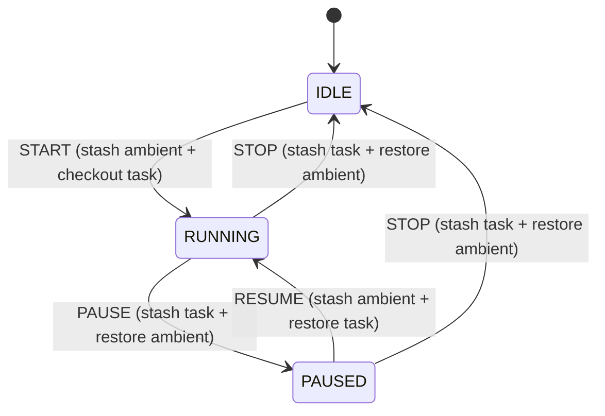
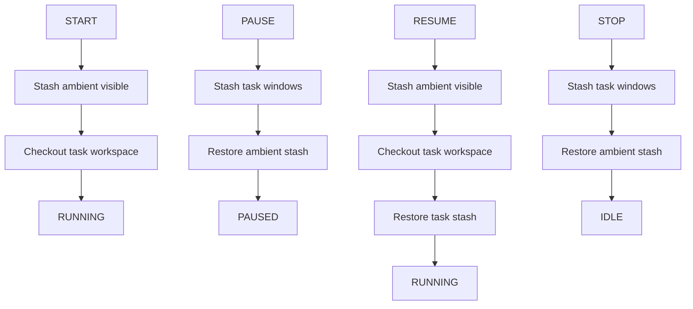

# Stage 3 Testing Guide: Workspace Management (Narrative Walkthrough)

This guide is written for human testers. It explains what each workspace
management button does, how it maps to the git-like model, and how to validate
behavior. It ends with a feedback form.

## Prereqs
- macOS with AeroSpace running
- Stream Deck connected
- This repo built and running (`npm install`, `npm run dev`)

Optional:
- `DRY_RUN=1` for safe plan inspection (no window moves)

## One-time setup (selected task)

Stage 3 requires a selected task ID. The app auto-assigns a default task on
first run (pick via the VIEW layer on key 2), or you can set it in `state/appState.json`:

```json
{
  "version": 1,
  "selectedTaskId": "demo-task",
  "lifecycle": "IDLE"
}
```

Tip: any string works for now. The workspace name will be `task:demo-task`.

## Narrative: what you are testing

The Stream Deck is a git-style porcelain for windows:
- A task is a "branch" (workspace `task:<id>`).
- START/RESUME is "checkout + stash ambient".
- PAUSE is "stash task and return to ambient".
- STOP is "stash task and return to ambient (recoverable)".

Stage 3 never closes windows. Everything should be reversible via the stash.

## Button map (workspace management)

- Key 0: START / PAUSE / RESUME
  - START (IDLE): stash ambient, checkout task workspace.
  - PAUSE (RUNNING): stash task, restore ambient.
  - RESUME (PAUSED): stash ambient, checkout task, restore task.
- Key 1: STOP / RESUME (global stash toggle)
  - STOP (RUNNING/PAUSED): stash task, restore ambient, lifecycle -> IDLE.
  - RESUME (IDLE with stash@{0}): pop top stash.
- Key 2: VIEW layer toggle
  - Opens/closes a task/workspace browser (pagination + safe detach).
  - Tap opens the view; use ESC (key 4) to exit.

In the VIEW layer:
- Key 0: NEW (creates a new local task id like `adhoc-001` and checks it out)
- Key 1: PREV page
- Key 3: NEXT page
- Key 4: ESC (exit view)
- Key 2: page indicator (no action)
- Keys 5–14: task list
  - Tap: checkout + select, then exit VIEW back to MAIN (safe; does not start lifecycle)
  - Hold: detach windows from that task workspace to `inbox` and remove it from the local registry

## Git analogy (why it behaves this way)

- START == `stash` + `checkout` (safe focus change).
- PAUSE == `stash` task + return to ambient.
- RESUME == `stash` ambient + `checkout` + apply task stash.
- STOP == `stash` task + return to ambient (recoverable stop).

## Mermaid: lifecycle state machine



## Mermaid: high-level flow per action



## Test 1: START creates an ambient stash and focuses the task
1. Ensure multiple windows are visible across monitors.
2. Press **START** (button 0).
3. Expected:
   - Non-task windows are stashed to `STASH`.
   - The task workspace (`task:demo-task`) is summoned to the focused monitor.
   - `state/appState.json` shows `lifecycle: "RUNNING"` and `ambientStashId` set.

## Test 2: PAUSE stashes the task and restores ambient
1. With the task visible, press **PAUSE** (button 0).
2. Expected:
   - Task windows move to `STASH`.
   - The ambient view returns (previous visible workspaces reappear).
   - `state/appState.json` shows `lifecycle: "PAUSED"` and `pausedTaskStashId` set.

## Test 3: RESUME restores the task and hides ambient
1. Press **RESUME** (button 0).
2. Expected:
   - Current ambient windows are stashed.
   - Task workspace is summoned.
   - Task windows restore from `pausedTaskStashId`.
   - `state/appState.json` shows `lifecycle: "RUNNING"` and `ambientStashId` set.

## Test 4: STOP ends the task session (recoverable)
1. Press **STOP** (button 1).
2. Expected:
   - Task windows are stashed.
   - Ambient workspace returns.
   - `state/appState.json` shows `lifecycle: "IDLE"`.
   - `state/tasks.json` task entry has `lastStopStashId`.

## Test 5: Persistence across restart
1. Press **START**, then **PAUSE**.
2. Quit the app (Ctrl+C), then restart `npm run dev`.
3. Press **RESUME**.
4. Expected: task windows restore and lifecycle returns to `RUNNING`.

## Artifacts to inspect
- `debug/last-plan.json`
- `debug/last-exec-log.json`
- `state/appState.json`
- `state/globalStash.json`
- `state/tasks.json`

## Feedback form

### Tester info
- Name:
- Date:
- macOS version:
- AeroSpace version:
- Stream Deck model:

### Results (check one)
- START flow: [ ] pass [ ] fail
- PAUSE flow: [ ] pass [ ] fail
- RESUME flow: [ ] pass [ ] fail
- STOP flow: [ ] pass [ ] fail
- Persistence after restart: [ ] pass [ ] fail

### Notes per step
- START:
- PAUSE:
- RESUME:
- STOP:
- Restart/persistence:

### Issues
- What broke?
- Repro steps:
- Logs/errors (paste):

### UX feedback
- Were labels/colors clear?
- Any surprising behavior?

### Wishlist
- Most important missing capability:
- Next feature you want:
